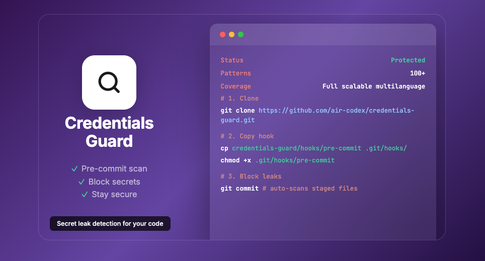

# Credentials-Guard



[](https://opensource.org/licenses/MIT)

---

**A pre-commit hook that kills credential data leaks before they happen — no AI tokens required.**

Inspired by [VibeGuard](https://github.com/majiayu000/vibeguard). Thx to @majiayu000


## Index

- [The problem](#the-problem)
- [Install](#install)
- [How it works](#how-it-works)
- [What you get](#what-you-get)
- [Scan Types](#scan-types)
- [Reports](#reports)
- [Bypass](#bypass)
- [Skills](#skills-optional-ai-integration)
- [Connect it to your agent](#connect-it-to-your-agent)
- [Customization](#customization)
- [Scripts](#scripts)
- [Files](#files)
- [Contributing](#contributing)
- [Disclaimer](#disclaimer)
- [License](#license)

## The problem

Basic security checks added as AI agent skills are not effective. Asking an agent to "check for data leaks" is inefficient, wastes tokens, and misses things. You need a minimal, autonomous security layer that runs without any AI involvement.

This project is for all of us doing vibe-coding who skip security steps. It runs a pre-commit / pre-push audit so credentials never reach your repositories. It also has a full project review for when you just installed it and want to make sure nothing is already exposed.

The code works automatically — no agent needed. It blocks commits when it detects anything matching its credential dictionary. Update the dictionary with your project's typical `.env` headers or any credential patterns you use to optimize it for your specific project.

Scans staged files for hardcoded secrets and blocks commits containing:
- **API keys**: OpenAI, Anthropic, Google, Mistral, Cohere, Hugging Face, Replicate, Neon, Supabase
- **Cloud providers**: AWS, Azure, Google Cloud, DigitalOcean, Cloudflare
- **Platform tokens**: GitHub, GitLab, Slack, Discord, Stripe, Twilio, SendGrid
- **Connection strings**: PostgreSQL, MySQL, MongoDB, Redis, AMQP
- **Auth patterns**: Bearer tokens, JWT, OAuth, Basic auth
- **Private keys**: RSA, EC, DSA, OpenSSH, PGP

**Scalable**: The scanner detects anything you add to the [credential patterns template](credential-patterns.example.txt). Add your own providers, custom env vars, or project-specific secrets — the more patterns you add, the more it catches. Easy to improve over time.

## Install

```bash
# 1. Clone
git clone https://github.com/air-codex/credentials-guard.git ~/credentials-guard

# 2. Copy to your project
cp ~/credentials-guard/hooks/pre-commit .git/hooks/pre-commit
chmod +x .git/hooks/pre-commit
cp ~/credentials-guard/credential-patterns.example.txt credentials/credential-patterns.txt

# 3. Customize (add your project-specific patterns)
# Edit credentials/credential-patterns.txt

# 4. Uncomment credentials/ in .gitignore (IMPORTANT)
# The .gitignore has these lines commented out as a guide.
# Uncomment them to avoid committing your local patterns and reports.
```

> **Important**: The `credentials/` folder contains your local patterns and scan reports. Never commit it to version control.

> **Note**: The `.gitignore` in this repo has `credentials/` entries commented out as a guide. When you use this in your project, uncomment those lines to avoid committing your local patterns and reports.

> **Never exclude README files from the audit** — READMEs are the most common source of hardcoded keys and secrets. If your README triggers a false positive (example patterns, documentation), review it visually and use bypass only if everything is clean:

## How it works

1. You stage files with `git add`
2. You run `git commit`
3. The pre-commit hook scans staged files against the credential patterns
4. If a match is found → commit is **BLOCKED** and a report is generated
5. If clean → commit goes through

The hook uses the same regex patterns that tools like GitHub Secret Scanning use. It catches API keys, database passwords, connection strings, private keys, and anything else you add to the patterns file.

**Example: trying to commit an API key**

```bash
$ git add src/config.ts && git commit -m "add config"
Running credential scan...

==========================================
  CREDENTIAL LEAK DETECTED — COMMIT BLOCKED
==========================================

File: src/config.ts
Report: credentials/reports/pre-commit-20260616-220020.md
```

**After reviewing and fixing:**

```bash
$ git add src/config.ts && git commit -m "add config"
Running credential scan...
Credential scan: PASS
```

## What you get

| Layer | What it does |
|-------|--------------|
| **Pre-commit hook** | Blocks commits with hardcoded secrets automatically |
| **Credential patterns** | 143+ patterns covering all major providers and formats |
| **Scan scripts** | Manual audits for unstaged, staged, or full project |
| **Markdown reports** | Clickable file links + line numbers for fast remediation |
| **Bypass mechanism** | Override when safe, with audit logging |
| **Skills** | Optional AI agent integration for analysis |

## Scan Types

| Scan | Mode | Command |
|------|------|---------|
| **Pre-commit** | Automatic | Runs before every `git commit` |
| **Unstaged** | Manual | `./scripts/scan-unstaged.sh` |
| **Staged** | Manual | `./scripts/scan-staged.sh` |
| **Full Project** | Manual | `./scripts/scan-full-project.sh` |

## Reports

All scans generate markdown reports with:
- Clickable file links (relative paths)
- Line numbers for each detected secret
- Code snippets showing the matched content

Reports are saved in `credentials/reports/` with date-based filenames (e.g., `full-project-20260616-201500.md`).

**Important**: The `credentials/` folder is gitignored to avoid committing scan results and local patterns.

### Report example

When a leak is detected, the report shows exactly where:

```markdown
# Pre-commit Credential Scan

- **Date**: 2026-06-16T22:24:48Z
- **Project**: credentials-guard
- **Branch**: main
- **Scope**: Staged files only
- **Patterns**: 143

## Status: BLOCKED

### Scanned files

- README.md
- scripts/README.md

### Files with leaks

- [README.md](../../README.md)

### Details

### [README.md](../../README.md)

159:42:const API_KEY = "sk-proj-abc123def456ghi789jkl012mno"
224:YOUR_API_KEY=[^#=\s]
225:YOUR_DB_PASSWORD=[^#=\s]

### Bypass options

touch credentials/bypass-scan
git commit
```

## Bypass

The hook will sometimes block commits that contain false positives — example keys in documentation, test patterns, or placeholder values in READMEs. These are not real secrets, but the scanner can't tell the difference.

**When to use bypass:**
- You've reviewed the report and confirmed all findings are false positives
- The detected "secrets" are example values, documentation, or test patterns
- You're committing documentation that explains how to use credentials

**How to bypass:**

1. Review the report to confirm nothing is a real leak:
```bash
cat "$(ls -t credentials/reports/*.md | head -1)"
```

2. If clean, create the bypass file and commit:
```bash
touch credentials/bypass-scan
git commit
```

**Never bypass without reviewing first.** The bypass is logged in `credentials/scan-log.txt` for audit purposes.

## Skills (Optional AI Integration)

This code runs automatically with git via the pre-commit hook — **no AI tokens consumed**.

If you want your AI agent to be aware of scans, connect the skills from `skills/`. However, be careful:

- **Small projects**: Safe to connect, minimal token usage
- **Large projects**: Scanning hundreds of files can consume significant tokens

| Skill | Command | Purpose |
|-------|---------|---------|
| `full_project_review` | `./scripts/scan-full-project.sh` | Periodic audit, before releases |
| `unstaged_review` | `./scripts/scan-unstaged.sh` | Before staging changes |
| `analyze_report` | `cat "$(ls -t credentials/reports/*.md | head -1)"` | Analyze report for real threats |

**Recommendation**: Let git handle scans automatically. Only use skills when you need AI analysis of results.

## Connect it to your agent

You can connect this to an AI agent using the skills in `skills/`. This makes sense when you're running something automatic and want your agent to review the reports that get generated — tell you what's real, what's a false positive, or even execute cleanup tasks.

The agent reads the report, analyzes the findings, and can take action: remove real secrets, ignore false positives, or alert you about critical leaks.

Just point your agent to the skills and it will know what to do.

## Customization

### Adding project-specific patterns

Edit `credentials/credential-patterns.txt` and add at the bottom:

```
# ============================================
# YOUR PROJECT-SPECIFIC PATTERNS
# ============================================

YOUR_API_KEY=[^#=\s]
YOUR_DB_PASSWORD=[^#=\s]
YOUR_SECRET_KEY=[^#=\s]
```

### Adding new providers

Add to `credentials/credential-patterns.txt`:

```
# New provider
newprovider_[a-zA-Z0-9]{20,}
```

## Scripts

| Script | Purpose | When to use |
|--------|---------|-------------|
| `scripts/scan-unstaged.sh` | Scan modified but not staged files | Before `git add` |
| `scripts/scan-staged.sh` | Scan staged files | After `git add`, before commit |
| `scripts/scan-full-project.sh` | Scan ALL tracked files | Periodic audit, after install |
| `scripts/scan-external.sh` | Scan another project (no residues) | Auditing external code |
| `scripts/check-install.sh` | Verify installation is working | After install, troubleshooting |
| `scripts/security-score.sh` | Rate project security (A-F) | Check security posture |
| `scripts/stats.sh` | Scan statistics and bypass audit | Review activity |

See `scripts/README.md` for detailed documentation.

## Files

| File | Purpose |
|------|---------|
| `.claude/CLAUDE.md` | AI agent rules for this project |
| `.claude/commands/cg/` | Claude slash commands (scan, score, check, report) |
| `hooks/pre-commit` | Pre-commit hook script |
| `credential-patterns.example.txt` | Example patterns (copy to `credentials/` and customize) |
| `credentials/` | Your local patterns and reports |
| `scripts/` | Scan and observability scripts |
| `scripts/README.md` | Scripts documentation |
| `skills/` | AI agent skills (optional) |
| `skills/README.md` | Skills documentation |
| `test-config-sample.ts` | Example file with fake secrets for testing |
| `.gitignore` | Gitignore guide (credentials/ commented) |
| `setup.sh` | Setup script for new projects |
| `CONTRIBUTING.md` | Contribution guidelines |
| `docs/README.md` | Full documentation |

## Contributing

Contributions welcome! Please open an issue or PR.

## Disclaimer

This project is in early stages. It's functional and has passed minimal testing for my personal use, but it has a lot of room for improvement. That's why I'm making it open source — so the community can contribute and make it better together.

If you want to contribute code, please read `CONTRIBUTING.md` first. Thanks!

## License

MIT
